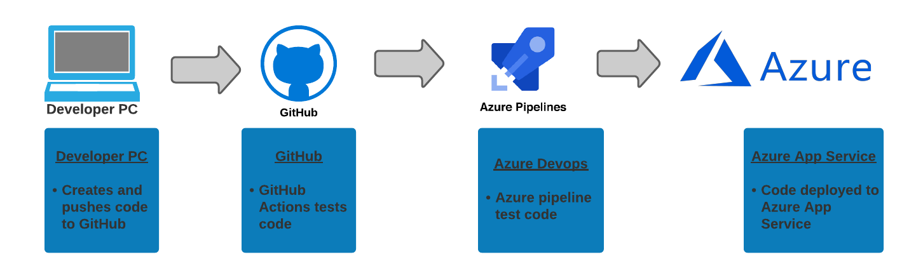
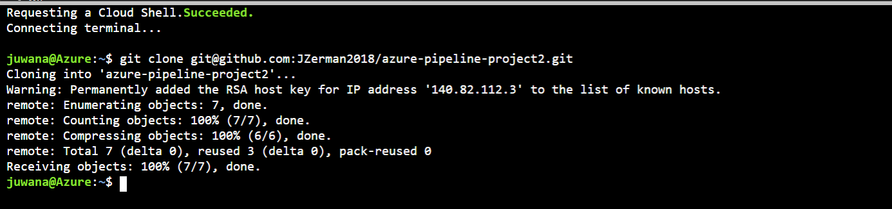
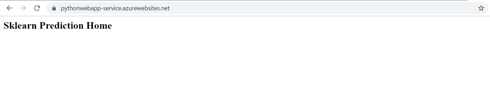
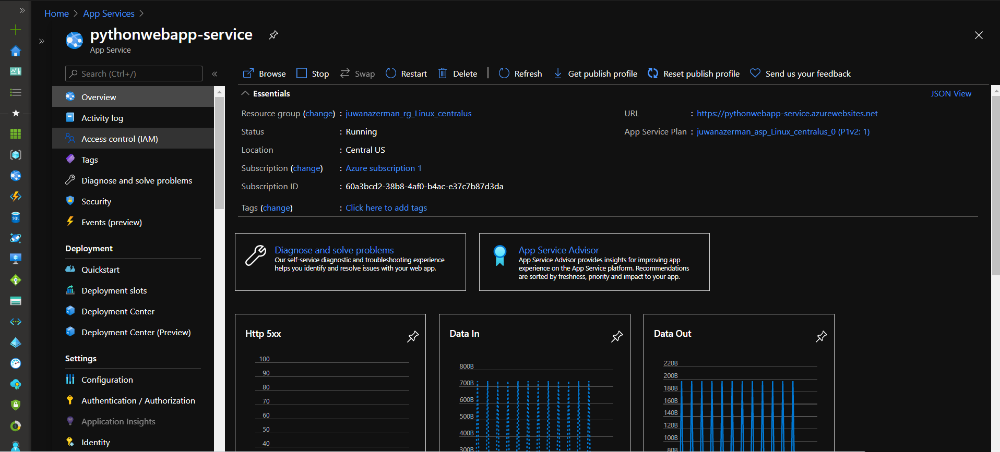
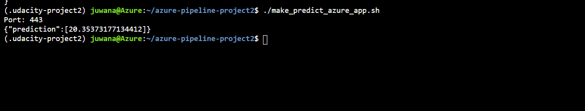
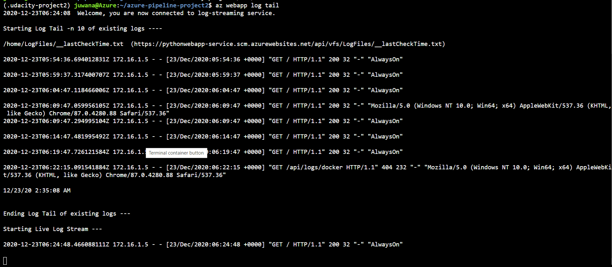
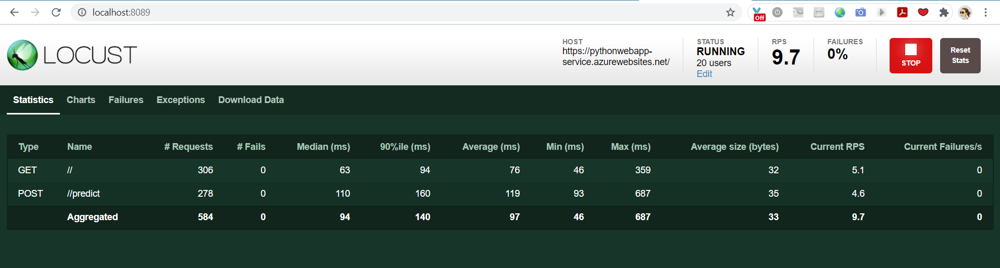

# Azure-Pipeline-Project2

By Juwana Zerman

# Overview

This is project 2 for the Devops Engineer for Microsoft Azure nanodegree program with Udacity.  This project demonstrates my ability to create a scaffolding that will perform continuous integration and delivery. Continuous Integration was tested using GitHub Actions to perform lint, test, and install cycles. The project was then integrated with Azure Pipelines to enable Continous Delivery to the Azure App Service. With any changes made to GitHub, GitHub Actions and Azure Pipelines will test and build the code.

## Project Plan
* Spreadsheet for project plan: https://docs.google.com/spreadsheets/d/1APaypWUzPNIkTpFBGg6qxQ9pGLnnyaJ9OCW3kIPEHqU/edit?usp=sharing
* Trello board for the project: https://trello.com/b/hfbGHfqN/project-2-ci-cd

## Architectural Diagram

## Instructions

- In Azure Cloud Shell, clone the repo using the command:
  `git clone git@github.com:JZerman2018/azure-pipeline-project2.git`
  
  

- Generate an ssh-key in Azure Cloud Shell and add it to GitHub:
  `ssh-keygen -m PEM -t rsa -b 4096`
- Once that's created the output will have the file where the ssh key is saved usually similar to `/home/azureuser/.ssh/id_rsa.pub`. You may cat this file and get the full ssh     key and navigate to settings in GitHub, SSH and GPG keys, and save this in a new SSH Key. This will authenticate your Cloud Shell with GitHub.

- Change into the cloned directory:
  `cd azure-pipeline-project2`

- Create a virtual environment:
  `make setup`

- Next run `make all` to install of the dependencies in the virtual environment. This command will also run the test cases that are present. The passing test cases are shown   below.

  .png)

## Configure and use GitHub Actions to Test the Python Project

- Enable GitHub Actions in the repository and select a Python Application workflow to test the build. If it builds successfully you should see a page similar to this:

  
  
## Create an Azure Pipeline

- Navigate to the [Azure Devops page](https://dev.azure.com/)
- Create a new private project
- Under Project Settings create a new service connection to Azure Resource Manager, scoped to your subscription and resource group.
- Create a new pipeline using your GitHub repo. If this builds successfully you will see a page similar to the following screenshot:

## Deploy the Webapp to Azure App Service

- Create and deploy the flask app to Azure App Service using  the `az webapp up -n pythonwebapp-service` command. When the Webapp is running the flask app can be seen in the browser at https://pythonwebapp-service.azurewebsites.net/.

- Screenshot of the pythonwebapp in Azure App Service:

- After deployment, running the script `./make_predict_azure_app.sh` will make a prediction. ** Note: You may need to make this file executable by running the command `chmod +x make_predict_azure_app.sh.` ** 
This screenshot shows a successful prediction made from the deployed Flask app in Azure Cloud Shell.

- Optionally, you may view the streamed log files for the deployed application using the command:
`az webapp log tail`

## Load Test

The application can be load tested using [Locust](https://locust.io/). This will need to be done locally instead of in Azure Cloud Shell. A required `locustfile.py` has already been created using the documentation samples from [Locust](https://locust.io/).

- Clone this repo to your local machine using: `git clone git@github.com:JZerman2018/azure-pipeline-project2.git` and install all the dependencies

- Install locust
  `pip3 install locust`
  
- Start the app:
  `python app.py`
  
- Start locust:
  `locust`
  
- Next, open your browser to `http://localhost:8089` and enter the number of users to simulate, spawn rate, host should be set to the Azure App service endpoint for the webapp of `https://pythonwebapp-service.azurewebsites.net/`, and then click Start Swarming.
This is a screenshot of the Locust entry page:

- Once you click start swarming Locust will start to test and you can view the test data.

## Enhancements

In the future these skills can be practiced using Azure Repos and trying another CI/CD service such as [Jenkins](https://www.jenkins.io/) or [CircleCI](https://circleci.com/).

## Demo

Video Link to Demo this project --> Link Here

